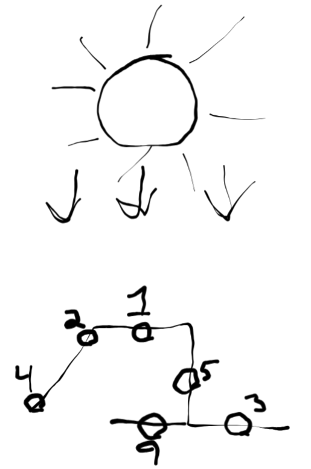
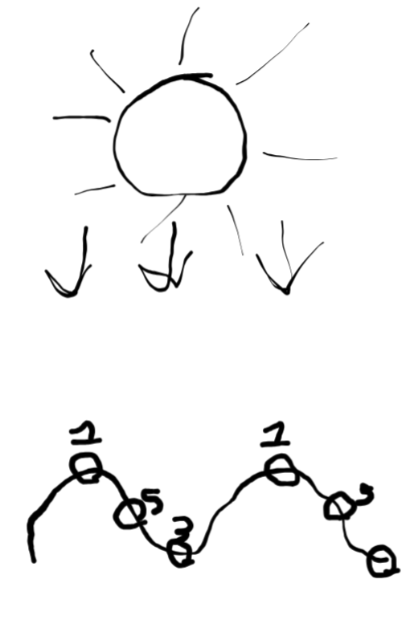
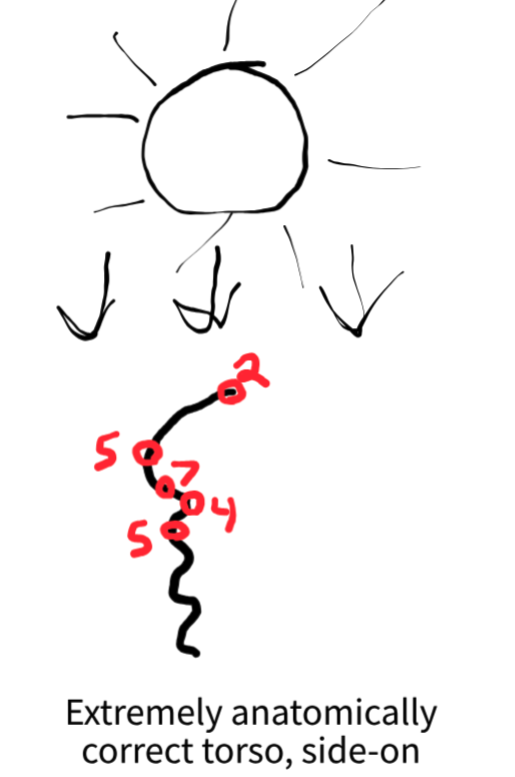

1. "Nail light placement & contrast and you're 75% of the way there."
1. For the purposes of this workshop, we're focusing on zenithal lighting as it's 1) simpler, and 2) can be extended to apply to other situations.
1. Rules for light:
  1. Depending on the size of the lightsource, a surface parallel to the light rays will be in shadow or in midtones. Something like the sun creates midtones, something like a torch creates shadows.
  1. The closer the surface is to the lightsource, the brighter it is. Hence: a flat angled surface will get a gradient.
  1. The more perpendicular to the light the surface is, the brighter it is.
  1. Generally speaking, shape will trump distance when it comes to value.
1. "Brighter means higher value, and probably more yellow"
1. The same way that shape trumps distance, surface texture trumps shape.
1. In the torso example, note that there should be no gradient between the shadow 7 and the bright 4 of the next ab. It should be a hard shadow.

