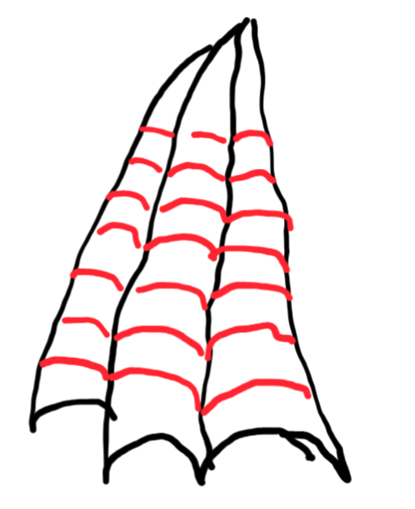
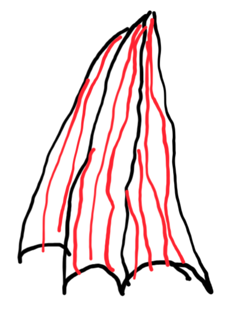
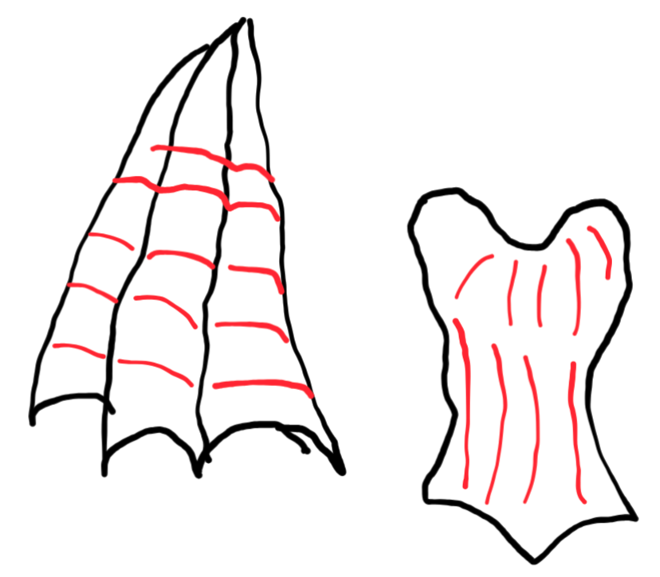
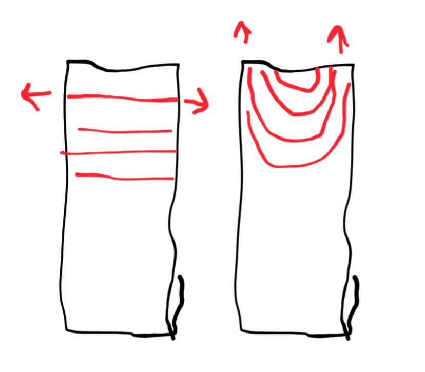

1. "When I paint huge models I always use light and dark alternately"
1. Always sketch the entire model, rather than painting a single piece to completion
1. Kaha's primary ways to create contrast:
  1. Light v. dark
  1. warm v. cold
  1. brush movements
1. "I use many colours, but they're not super visible." Pick a main colour, but use a lot in small details.
1. "When I start [sketching], I don't use too many colours. I choose pure colours for initial contrast"
1. *Always* do sketches, use photoshop, etc... and check if the composition is actually doing what you want: your focal points are actually focal, your value sketch is decent, etc...
1. "If I use blue on the wings, we also need to use blue on other parts to create harmony."
1. "On this green armour I use all colours from the colour wheel, but from a distance it's still green"
1. "Many people make this mistake when painting swords. They paint it like this [brush motion perpendicular to the spine], but they should be doing it length-wise"
1. "Painting wings like this [across the membrane] really draws attention to the membranes"

1. "Painting them this direction [length-wise] makes the wings look longer and draws attention to the bones"

1. "This'll create contract between the wings and the body"

1. The post itself also impacts what contrasts we have access to
1. "I always try to create some shapes in the composition. It might make sense to move the light to make that work."
1. "Our eyes are drawn to warm colours."
1. "If we use the round direction to shape highlights [to shape highlights], the surface starts to look more round."
1. In addition to changing the appearance of the surface, our brush direction can change how focus moves across the model.

1. "If we just make the wings all dark, it gets really boring. But if we follow the [compositional] triangle, it becomes easy to see we should highlight thie tops of the wings."
1. "I really recommend using ink because it's so easy to change the shade of your colours"
1. "A round [compositional] shape is easiest, it works with all pieces."
1. "When I am building the base, I also contrast the lines [of action] with the model"
1. "In the beginning I usually cover the whole surface with ink to mediate the colour. I also use them on smaller surfaces, and sometimes even use them instead of water [to thin paint]" She prefers scalecolour inks specifically.
1. You *can* mix complementary colours and avoid muddy grays (at least sort of), but you need to do it by mixing your way along the colour wheel.
1. "We need to make sure the colours inside the [compositional] triangle are brighter than those outside it".
1. "The easiest way to do NMM on round surfaces is radial lines alternating light and dark....The top is brighter"
![Example of radial lines]
